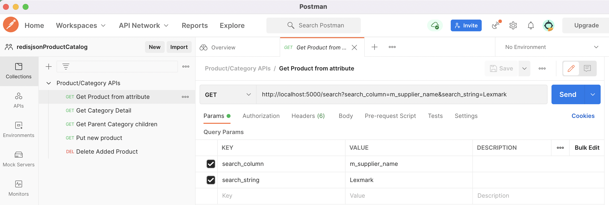

# redisPythonProductCatalog
A simple product catalog solution based on icecat files
## Initial project setup
Get this github code
```bash 
get clone https://github.com/jphaugla/redisPythonProductCatalog.git
```
Two options for setting the environment are given:  
  * run with docker-compose using a flask and redis container
  * installing for mac os
  * running on linux (probably in the cloud)

docker-compose is much easier and is main method documented here
## docker compose startup
```bash
docker-compose up -d --build
```
## Code and File discussion
This is an implementation of a product Catalog using data download from
 [icecat](https://iceclog.com/open-catalog-interface-oci-open-icecat-xml-and-full-icecat-xml-repositories/)

### Download the datafiles to the data subdirectory
* To download the datafiles, a free login id from icecat is required.  *WARNNING* these data files are large especially prodid_d.txt (over 4GB).
* Once effectively registered to ICECAT, need to retrieve these files using the registered username and password.  The quotes are needed.  Also gunzip the files.
```bash
mkdir data
cd data
curl -u 'yourUN':'yourPW' https://data.Icecat.biz/export/freexml/refs/CategoriesList.xml.gz -o CategoriesList.xml.gz
gunzip CategoriesList.xml.gz
mkdir index
cd index
curl -u 'yourUN':'yourPW' https://data.Icecat.biz/export/freexml/files.index.csv.gz -o files.index.csv.gz
gunzip files.index.csv.gz
cd ..
mkdir prodid
cd prodid
curl -u 'yourUN':'yourPW' https://data.Icecat.biz/prodid/prodid_d.txt.gz -o prodid_d.txt.gz
gunzip prodid_d.txt.gz
```

### Set environment

The docker compose file has the environment variables set for the redis connection and the location of the data files.
This code uses redisjson and redisearch.  The redis database must have both of these modules installed.
As of this writing, this redismod docker image (which includes these modules) does not work on the m1 arm64 based mac.  
Default docker-compose is set to redismod

### load categories
The redis node and port can be changed. The python code uses 2 environment variable REDIS_SERVER and REDIS_PORT.  The default is REDIS_SERVER=redis and REDIS_PORT=6379
```bash
docker exec -it flask bash -c "python categoryImport.py"
```
### load Product Title
This can take quite a long time (maybe 35 minutes).  It is possible to speed the product load by splitting the file.
The python code to load the products uses python multi-processing based on the number of files found in the data/prodid directory.
To facilitate this splitting of the file while keeping the header row on each of the split files,
a script is provided to split the file into chunks.  This will create the separate files in the prodid directory
and move the original prodid_d.txt file up to the data directory.  Set the PROCESSES environment variable depending on power of client machine.  Can adjust 
the splitProdid.sh script to make a number of files that is a multiple of the PROCESSES parameter.
These is a script steps to do this:
```bash
cd scripts
./splitProdid.sh
```

The redis node and port can be changed. The python code uses 2 environment variable REDIS_SERVER and REDIS_PORT.  
The default is REDIS_SERVER=redis and REDIS_PORT=6379.  See the docker-compose.yml file.
```bash
docker exec -it flask bash -c "python productTitleImport.py"
```
Can observe the load progress by watching the load for each file
```bash
docker exec -it redis redis-cli hgetall prod_title_load:prodid_d.txt.00063.csv
```
### load Products
This can take quite a long time (maybe 35 minutes).  It is possible to speed the product load by splitting the file.
The python code to load the products uses python multi-processing based on the number of files found in the data/index directory.
To facilitate this splitting of the file while keeping the header row on each of the split files,
a script is provided to split the file until 100,000 row chunks.  This will create the separate files in the index directory
and move the original files.index.csv file up to the data directory.  Set the PROCESSES environment variable depending on power of client machine.
Can adjust the splitFile.sh script to make a number of files that is a multiple of the PROCESSES parameter.
These is a script steps to do this:
```bash
cd scripts
./splitFile.sh
```
The redis node and port can be changed. The python code uses 2 environment variable REDIS_SERVER and REDIS_PORT.  
The default is REDIS_SERVER=redis and REDIS_PORT=6379.  See the docker-compose.yml file.
```bash
docker exec -it flask bash -c "python productImport.py"
```
Can observe the load progress by watching the load for each file
```bash
docker exec -it redis redis-cli hgetall prod_load:files.index.00004.csv
```
  * THIS IS HOW to start flask app server
  * However, it is already running as part of the flask container
 ```bash
docker exec -it flask bash -c "python appy.py"
 ```
  * run API tests
Easiest is to run the API tests using Postman.  Running Postman, use File->Import to import
the following file for use with Postman-https://github.com/jphaugla/redisJSONProductCatalog/blob/main/scripts/Product-Category%20APIs.postman_collection.json
Once the collection is imported, run each request to test the APIs.

Alternatively, use the commands in this file https://github.com/jphaugla/redisJSONProductCatalog/blob/main/scripts/sampleput.sh
Make sure to use *bash* as *zsh* has issues with the curl command 
Note:  there are multiple API tests in the file but only one should be run at a time
So, the tests not to be run should be commented out.  

  * run sample search queries   
run sample redisearch queries as provided.  Run one at a time using

```bash
redic-cli -f scripts/searchQueries.txt
```

##  Notes for running outside of Docker
Follow most of the same steps as above with some changes

### Instead of docker to execute, use python virtualenv
  * create a virtualenv
```bash
cd src
python3 -m venv venv
source venv/bin/activate
```
   * Use an environment file for locations
   * Can also set the number of concurrent processes for the client using the "PROCESSES" environment variable

```bash
source scripts/app.env
```
  * execute python scripts from the src directory
```bash
cd src
pip install -r requirements.txt
python categoryImport.py
python productImport.py
python app.py
```

###  installing on mac
1. install xcode
2. install homebrew
```bash
/usr/bin/ruby -e "$(curl -fsSL https://raw.githubusercontent.com/Homebrew/install/master/install)"
```
3. verify homebrew
```bash
brew doctor
```
4. install python
```bash
brew install python
```
5. install redis-py
```bash
pip install redis
```
6.  install flask
```bash
pip install flask
```
6. clone repository
```bash
git clone https://github.com/jphaugla/redisPythonProductCatalog.git
```
7. install redis
```bash
brew install redis
```
8. start redis 
	redis-server /usr/local/etc/redis.conf

